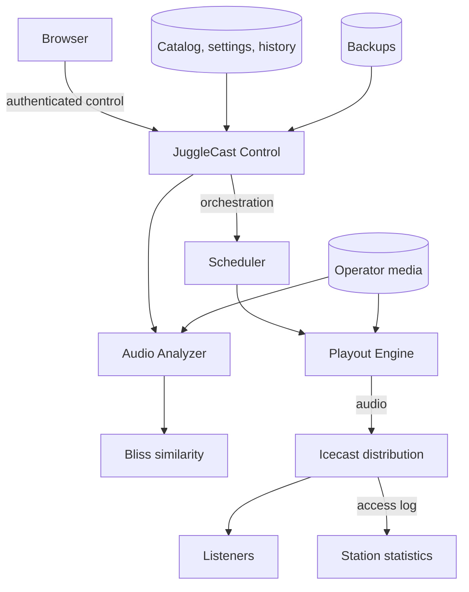

# JuggleCast Radio Automation

**Self-hosted radio automation, intelligent scheduling and dedicated audio playout — under your control.**

JuggleCast is a self-hosted radio automation platform for operators who want to schedule, automate and broadcast an Icecast station without maintaining a Liquidsoap scripting layer.

Its scheduler, audio analysis services and dedicated Rust playout engine are designed as one system, with configurable transitions, BPM-aware programming and optional Bliss-powered acoustic similarity.

**Automate · Broadcast · Stay independent**

[🎧 Listen to the live station](http://radio.chouproxai.duckdns.org/api/public/stations/rub-a-dub_mix) · [Install JuggleCast](#installation) · [Documentation](docs/README.md) · [Releases](https://github.com/chourmovs/FlowCast-Community/releases) · [Security](SECURITY.md) · [Support](SUPPORT.md)

[](https://github.com/chourmovs/FlowCast-Community/releases)
[](https://github.com/chourmovs/FlowCast-Community/actions/workflows/validate.yml)
[](LICENSE)


> **Live demonstration**
>
> The public station page is powered by JuggleCast and lets you hear the playout engine while inspecting the current track and station activity.
>
> **[Open the live JuggleCast station →](https://chourmovs.github.io/FlowCast-Community/)**
>
> Availability is provided on a best-effort basis and may be interrupted during preview deployments or maintenance.

JuggleCast Community packages the installer, deployment contracts, documentation and authenticated control plane required to operate the versioned broadcast services on an operator-managed Linux host. The service images are separately licensed; this repository does not claim that their source code is open.

---

## What JuggleCast does

JuggleCast provides the complete path from an operator-owned media library to a continuously programmed Icecast stream:

1. import and analyse audio;
2. organise tracks into playlists;
3. define schedules and programming rules;
4. build a coherent upcoming queue;
5. apply configurable transitions;
6. play and encode the audio through the dedicated engine;
7. distribute the stream through Icecast;
8. expose Now Playing, upcoming tracks, history, logs and diagnostics;
9. publish listener-safe station pages and embeddable widgets;
10. observe station-scoped audience statistics;
11. create portable backups and perform guarded restores.

The objective is not simply to shuffle tracks without silence. JuggleCast is designed to make an automated station sound deliberately programmed.

---

## Why JuggleCast is different

JuggleCast is not simply a web interface placed in front of a generic streaming script. Its scheduler, audio analysis and playout engine are developed together as a complete radio automation system.

### No Liquidsoap scripting layer

Many self-hosted radio platforms ultimately require operators to understand, generate or troubleshoot Liquidsoap scripts.

JuggleCast takes a different approach.

Its dedicated Rust playout engine receives an explicit station configuration and executes the broadcast directly. Operators configure playlists, scheduling, transitions and station behaviour without maintaining a separate domain-specific playout script.

This means:

- no Liquidsoap syntax to learn;
- no generated script to inspect when something behaves unexpectedly;
- no fragile custom script fragments to maintain across upgrades;
- fewer abstraction layers between the control interface and the audio engine;
- a playout runtime developed specifically around JuggleCast's scheduling model.

You configure the desired broadcast behaviour — not the implementation script behind it.

### Transitions are a first-class feature

JuggleCast treats the transition between two tracks as part of the programming, not as a fixed crossfade added at the end of the audio pipeline.

Transition parameters can be tuned to shape the identity of the station:

- fade-in and fade-out timing;
- overlap duration;
- bridge duration;
- track exit timing;
- queue and prefetch behaviour;
- transition-aware playout decisions.

**A continuous radio stream should sound programmed — not shuffled.**

### Music-aware programming

JuggleCast can use track tempo as part of the scheduling and selection process. BPM-aware programming helps build sequences with more coherent changes in pace and energy while keeping editorial rules in control.

JuggleCast Pro can extend music-aware selection using acoustic similarity features produced through Bliss analysis.

---

## A different approach to radio automation

| Conventional script-centric stack | JuggleCast |
| --- | --- |
| Playout behaviour expressed through a separate scripting language | Dedicated playout engine controlled through explicit JuggleCast configuration |
| Transitions commonly reduced to a global crossfade | Fine-grained transition timing, overlap and bridge controls |
| Rotation primarily based on metadata, clocks and random selection | Scheduling enriched with BPM-aware selection |
| Advanced musical sequencing requires custom logic | Optional Bliss-driven acoustic similarity with JuggleCast Pro |
| Troubleshooting often requires inspecting generated scripts | Runtime state, history, logs and diagnostics exposed through JuggleCast |
| Changes may require editing or regenerating playout code | Station behaviour configured without writing playout scripts |

---

## Who JuggleCast is for

JuggleCast is intended for:

- self-hosters operating their own radio infrastructure;
- web radio operators who want explicit control over scheduling and playout;
- music enthusiasts building a curated continuous station;
- associations, collectives and small broadcasters;
- developers and operators looking for a self-hosted Icecast automation stack without Liquidsoap scripting.

JuggleCast Community is currently distributed as a **Community Preview**.

---

## Core capabilities

### JuggleCast Community

The Community edition provides the complete autonomous broadcast path:

- authenticated station control;
- media library management;
- playlist creation and organisation;
- scheduled programming;
- BPM-aware music selection;
- configurable track transitions;
- dedicated Rust playout engine;
- audio analysis;
- Icecast stream delivery;
- Now Playing, upcoming-track information and engine history;
- public station pages with listener-safe programming data;
- embeddable player, recently played, upcoming and listener-count widgets;
- three genuine player layouts: Normal, Compact and Minimal;
- station-scoped audience statistics with real-time, trends and reports;
- country, player-family and device-family audience breakdowns;
- Essential `.fcbak` backups;
- Full backups including media;
- resumable backup uploads with Pause/Resume/Cancel;
- transactional restore with pre-restore snapshot and rollback safeguards;
- controlled updates and host-level rollback;
- installation diagnostics through `doctor.sh`;
- optional Docker Control for service operations.

Community starts and broadcasts without a paid licence and without a mandatory remote licence-service request.

### JuggleCast Pro

JuggleCast Pro builds on the Community broadcast foundation with optional advanced capabilities, including:

- Bliss-driven acoustic similarity;
- music-aware sequence optimisation;
- advanced transition and programming strategies;
- additional operational or fleet-oriented services when officially documented;
- commercial licensing and support options.

Pro remains optional. The Community broadcast path continues operating independently if Pro is not configured or its licensing service is unavailable.

---

## New in RC8

### Backup & Restore

RC8 adds portable Essential and Full `.fcbak` archives. Full backups can include the media library and run as persistent isolated jobs. Large archive uploads are resumable, and restore is guarded by validation, capacity checks, media locking, a pre-restore snapshot and an automatic rollback attempt.

### Station Statistics

The Statistics page is station-scoped and backed by real Icecast activity. It provides Overview, Real-Time and History & Reports views with listener sessions, time-series samples, trends, countries, players and devices.

Icecast logs are persisted locally and mounted read-only into the control plane. Listener identifiers are derived locally with HMAC-SHA256; raw listener IP addresses are not stored by the statistics subsystem.

### Public station pages and widgets

Public station programming can expose Now Playing, recently played and upcoming tracks without leaking internal paths. External sites can embed a player, history, upcoming list or listener count.

Normal, Compact and Minimal players are structurally different components rather than the same player merely resized.

See [RC8 highlights and runtime notes](docs/community/rc8.md).

---

## Screenshots

Explore the JuggleCast control plane, from station configuration and media management to intelligent programming, playout supervision and broadcast operations.

<table>
  <tr>
    <td width="50%" valign="top"><a href="docs/assets/screenshots/Capture1.png"></a></td>
    <td width="50%" valign="top"><a href="docs/assets/screenshots/Capture2.png"></a></td>
  </tr>
  <tr>
    <td width="50%" valign="top"><a href="docs/assets/screenshots/Capture3.png"></a></td>
    <td width="50%" valign="top"><a href="docs/assets/screenshots/Capture4.png"></a></td>
  </tr>
  <tr>
    <td width="50%" valign="top"><a href="docs/assets/screenshots/Capture5.png"></a></td>
    <td width="50%" valign="top"><a href="docs/assets/screenshots/Capture6.png"></a></td>
  </tr>
  <tr>
    <td width="50%" valign="top"><a href="docs/assets/screenshots/Capture7.png"></a></td>
    <td width="50%" valign="top"><a href="docs/assets/screenshots/Capture8.png"></a></td>
  </tr>
</table>

<p align="center"><em>Click any screenshot to open the full-resolution view.</em></p>

See the [capture and publication procedure](docs/assets/screenshots/README.md).

---

## Community Edition

Community works without a paid licence, starts and broadcasts without a mandatory remote licence call, retains the essential broadcast path, and receives best-effort community support.

Pro is optional and separately licensed. Read [Community versus Pro](docs/community/community-vs-pro.md).

---

## Installation

**Current validated release: `0.1.0-rc.8`.**

**Requirements:** Linux amd64, Docker Engine, Docker Compose v2, 2 CPU cores, at least 4 GB RAM, 10 GB free disk plus media/backups, and free TCP ports **8080** for the control/player proxy and **8010** for direct Icecast access.

```bash
curl -fsSL https://raw.githubusercontent.com/chourmovs/FlowCast-Community/v0.1.0-rc.8/install.sh | sudo bash -s -- --version 0.1.0-rc.8
```

The tagged command installs the release declared in `version.env`. That file is the repository's single source of truth for the current JuggleCast Community release.

The installer writes `/opt/flowcast`, generates local credentials, pulls immutable versioned service images and waits for service health. It does not install Docker.

> **Security note:** the standard installation enables Docker Control. Mounting the Docker socket is equivalent to granting root-level host control to the control container. Use `--no-docker-control` to opt out, and never expose the control UI to untrusted users. See [Security](SECURITY.md).

### Review the installer before execution

```bash
curl -fsSLO https://raw.githubusercontent.com/chourmovs/FlowCast-Community/v0.1.0-rc.8/install.sh
less install.sh
sudo bash install.sh --version 0.1.0-rc.8
```

---

## First broadcast

1. Run the tagged installer above.
2. Open `http://localhost:8080` and sign in with the locally generated credentials.
3. Import operator-owned or freely licensed audio.
4. Create or select a playlist.
5. Configure its programming in the authenticated interface.
6. Start playout when Docker Control is enabled.
7. Listen through the control origin or through direct Icecast access.
8. Verify the installation:

```bash
sudo /opt/flowcast/scripts/community/doctor.sh
```

The diagnostic should end with:

```text
RESULT=PASS
```

Follow the complete [first broadcast guide](docs/how-to/first-broadcast.md).

---

## Updating

Create a backup before changing versions:

```bash
sudo /opt/flowcast/scripts/community/backup.sh
sudo /opt/flowcast/scripts/community/update.sh --version 0.1.0-rc.8
sudo /opt/flowcast/scripts/community/doctor.sh
```

The updater preserves credentials, persistent volumes and the explicit Docker Control choice, subject to the compatibility notes of the target release.

Preview releases do not guarantee downgrade-compatible persisted state. Read [Update and rollback](docs/community/update-rollback.md) and [Backup and restore](docs/community/backup-restore.md).

---

## Architecture



Control, orchestration, analysis, audio playout, distribution and named-volume storage are isolated roles. Details are in [Architecture](docs/community/architecture.md) and [Runtime contract](docs/community/runtime-contract.md).

---

## Community versus Pro

| Community | Pro |
| --- | --- |
| Autonomous broadcast path; no paid licence or mandatory licensing service | Optional, separate commercial licence |
| Control, scheduling, playout, streaming, public widgets, statistics and backup/restore | May add separately documented advanced functions or services |
| Best-effort community support | Commercial terms apply only when explicitly offered |
| Continues operating if an optional Pro licensing service is unavailable | Pro entitlement failure must not interrupt Community broadcasting |

---

## Documentation

- **Getting started:** [Quick start](docs/community/quick-start.md), [RC8 notes](docs/community/rc8.md), [first broadcast](docs/how-to/first-broadcast.md)
- **Broadcasting:** [Import music](docs/how-to/import-music.md), [playlists](docs/how-to/create-playlist.md), [programming](docs/how-to/schedule-programming.md)
- **Operations:** [Backup and restore](docs/community/backup-restore.md), [backup/update/rollback](docs/how-to/backup-update-rollback.md), [Docker Control](docs/how-to/docker-control.md)
- **Security:** [Security policy](SECURITY.md), [reverse proxy and TLS](docs/how-to/reverse-proxy-tls.md)
- **Architecture:** [System architecture](docs/community/architecture.md), [runtime contract](docs/community/runtime-contract.md)
- **Troubleshooting:** [Stream troubleshooting](docs/how-to/troubleshoot-stream.md), [known limitations](docs/community/known-limitations.md)

Browse the complete [documentation index](docs/README.md).

---

## Version management

The current repository release is declared only in:

```env
# version.env
FLOWCAST_VERSION=0.1.0-rc.8
```

Runtime configuration examples such as `.env.example` do not define the release version.

The following consumers read `version.env` directly:

- runtime-contract validation;
- release workflow;
- Compose validation;
- installer default;
- Astro website build.

Static documents such as this README cannot evaluate environment files when rendered by GitHub. Their active installation commands are therefore checked against `version.env` by CI.

Historical documentation may mention older releases when describing migrations or compatibility. Those references are not current release sources.

---

## Legal and licensing

Repository scripts and documentation are MIT licensed. JuggleCast Community OCI images use the licence declared in their published image metadata. Third-party components retain their own licences. Pro uses separate commercial terms, and trademark rights are separate.

Review the [licensing guide](docs/legal/licensing.md), [third-party notices](THIRD_PARTY_NOTICES.md), [trademarks](TRADEMARKS.md), [privacy](PRIVACY.md) and [disclaimer](DISCLAIMER.md).

The software is supplied without warranty. Operators remain responsible for infrastructure, data, broadcasts and applicable rights.

---

## Built with

JuggleCast's distributed runtime uses Python, Rust, FastAPI, NiceGUI, GStreamer, FFmpeg, Icecast, bliss-audio, SQLite and Docker. Each remains an independent project under its own terms.

---

## Acknowledgements

We thank the maintainers and contributors of the technologies that make self-hosted broadcasting possible.

See [Acknowledgements](ACKNOWLEDGEMENTS.md) and [Third-party notices](THIRD_PARTY_NOTICES.md). No third-party affiliation or endorsement is implied.

---

## Contributing and support

Use [issues](https://github.com/chourmovs/FlowCast-Community/issues) for reproducible, sanitised bugs and feature requests.

Use [Discussions](https://github.com/chourmovs/FlowCast-Community/discussions), when enabled, for community questions.

Read [Contributing](CONTRIBUTING.md) and [Support](SUPPORT.md).

Report vulnerabilities only through [private security reporting](SECURITY.md) — never in a public issue.
